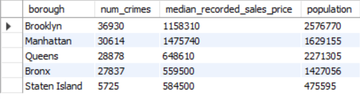
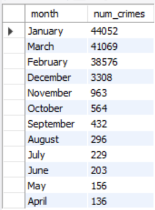
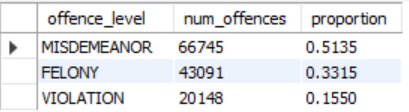
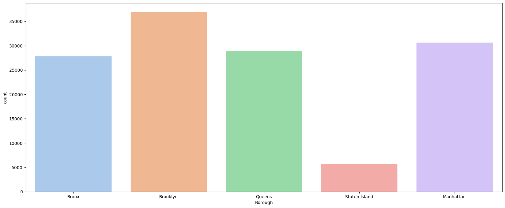
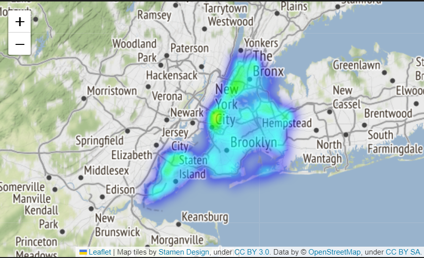
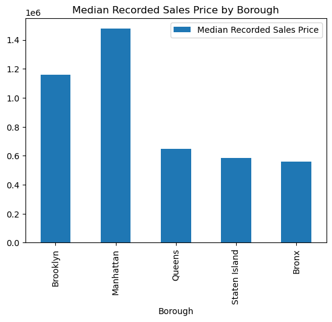

# ETL

## Índice

1. [Objetivo](#objetivo)
2. [Extracción](#extracción)
3. [Transformación](#transformación)
4. [Carga](#carga)
5. [Análisis](#análisis)

## 1. Introducción

Este proyecto tiene como objetivo realizar un análisis del índice de criminalidad en distintos distritos de Nueva York. 

## 2. Objetivo

El objetivo de este proyecto es la realización del proceso de ETL con los requisitos minimos de utilizar tres fuentes de información así como dos métodos distintos de eztracción de datos

## 3. Extracción

Para la extracción de datos he acudido a varías páginas web. En primer lugar parto de una base de datos sacada de NYPD Open Data para obtener el histórico de crimenes ocurridos en New York divido por fecha y barrio además de otras columnas que serán relevantes para fututos análisis.

Para completar la base de datos he accedido a la web NYC OpenData para sacar el número de habitantes por zona de New York 

En segundo lugar el coste de casas por zona de la web..

Por último del New York State Department of Health la población agrupada por distrito de Nueva York

## 4. Transformación

Para la limpieza de datos he eliminado aquellas columnas que no interesaban y en las tablas de population y precios de casas mediante groupbys he sacado por un lado la cantidad de gente por distrito en nueva york y por otro cual es la mediana de precio de venta y alquiler de casas por distrito en new york.

## 5. Carga

Una vez que se han realizado las operaciones ETL con SQLAlchemy, se cargan las tres tablas en una base de datos SQL para poder analizar los datos. A partir de ahí, se pueden crear las relaciones necesarias entre las tablas y lanzar consultas SQL para obtener información valiosa y llegar a conclusiones. En este proyecto, se ha utilizado este enfoque para analizar el índice de criminalidad en Nueva York y su relación con otros factores como el precio de la vivienda y la densidad de población en cada distrito.

## 6. Análisis 

- Relación entre la cantidad de delitos con el precio medio de las ventas de casas relacionado con la cantidad de población de cada zona. 

- Número de crimenes agrupado por mes 

- Cantidad de delitos por tipo de delito y su proporción en relación con el total de delitos cometidos en NY

## 7. Conclusión

Brooklyn es el barrio más grande de la ciudad y, por lo tanto, donde se registran la mayor parte de incidentes.

El mapa de calor muestra la distribución de los incidentes de disparos en la ciudad de Nueva York. Los puntos rojos más intensos representan las áreas donde se han reportado más incidentes de disparos, mientras que los puntos menos intensos representan las áreas donde se han reportado menos incidentes.

Ahora visualizamos con un gráfico cual es la mediana del precio al que se están vendiendo las casas por Borough en Nueva York. Dado que los distritos de Nueva York son grandes no se pueden sacar conclusiones estrictas de aquí ya qu ehabría que investigar por barrio.

## 8. Referencias

- https://data.cityofnewyork.us/Public-Safety/NYPD-Complaint-Data-Current-Year-To-Date-/5uac-w243